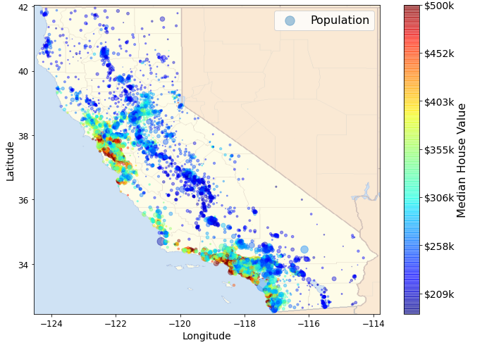
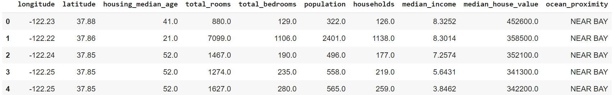

# End-to-End Machine Learning Project
## CA-housing-price-prediction

## Problem
In recent years, housing market is always hot. If we can predict a district’s median housing price, then we can feed them to another Machine Learning system along with many other signals to determine whether this district is worth investing in a given area or not.

The district housing prices are currently estimated manually by experts. It’s costly and time consuming.
In this project, we build an automatic model of housing price in the state. The model will learn from the data and ba able to predict the median housing price in any district.

## Solution

This project fits supervised Learning & regression task to predict a value among three basic ML algorithms.

It also fits batch learning since the data is plain to fit in memory.

We will compare linear regression with decision tree model and find the better one.

Finally, we can use RMSE to measure the performance.

## How to Run?

Platform: Google Colab
[End-to-End Machine Learning Project-- CA median housing price prediction](https://github.com/groovyxw/End-to-End-Machine-Learning--CA-housing-price-prediction/blob/main/ML_CA_median_housing_price_prediction.ipynb)

Step1: Click the above link, then click the icon "Open in Colab"

Step2: Just click "Run" for each code slip to walk though the whole process from scratch.

## Goole Slide Presentation

[End-to-End Machine Learning Project -- CA Median Housing Price Prediction](https://docs.google.com/presentation/d/1BpSwp4gEzM4z_vOQf3U66tkiXmjyGuEuH8gOWONNUmQ/edit?usp=sharing)
